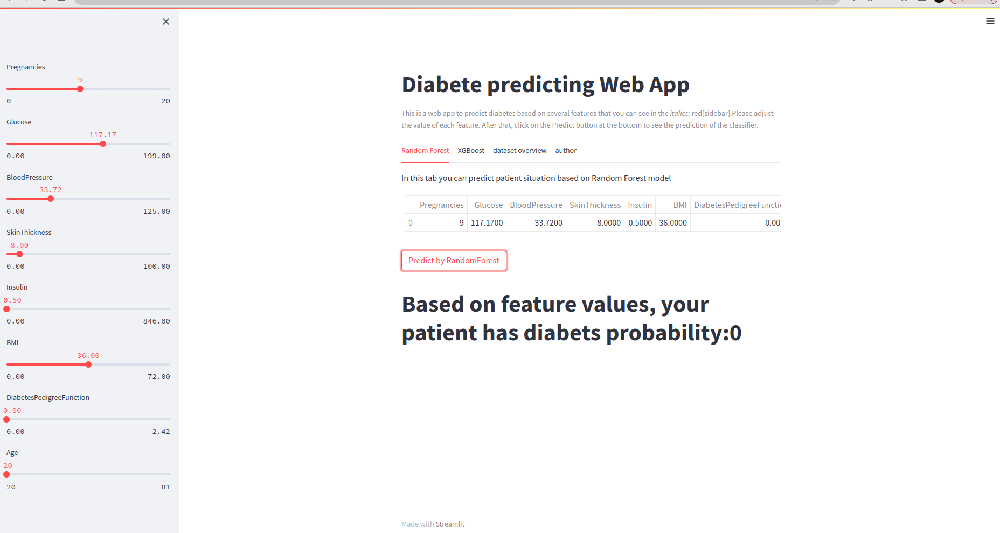

# Diabetes Prediction Web Application


### Introduction

This is a web application that uses machine learning to predict the probability of a person having diabetes based on several parameters. The application was developed using Python, Pycaret and Streamlit libraries, and deployed using Docker-Compose.


### Requirements

* Docker and Docker-Compose

#### Usage

1- Clone this repository

```
$ git clone https://github.com/massooti/random_forest_pycaret.git

```
2- Change into the project directory

```
$ cd diabetes-prediction-web-app

```

3- Build and run the Docker containers

```
$ docker-compose up -d

```
Open a web browser and go to http://localhost:8501 to access the web application
In the web application, users can adjust the parameters in the sidebar and see the prediction of the classifier by clicking the "Predict" button at the bottom.

#### Model Training
The model was trained using Pycaret on a diabetes dataset. The model uses Random Forest Classifier algorithm.Also
the model uses XGBoost Classifer too.

#### ScreenShot 



#### Conclusion
This project provides a simple and interactive way to test the probability of having diabetes. The web application can be easily modified and used for other similar projects.
